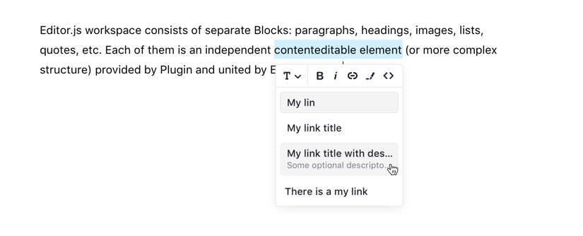

# Link Autocomplete

An upgraded version of base inline link tool with your server's search.



## Installation

### Install via NPM

Get the package

```shell
npm i --save-dev @editorjs/link-autocomplete
```

```shell
yarn add -D @editorjs/link-autocomplete
```

### Load from CDN

You can use package from jsDelivr CDN.

```html
<script src="https://cdn.jsdelivr.net/npm/@editorjs/link-autocomplete"></script>
```

## Usage

Add a new Tool to the `tools` property of the Editor.js initial config.

```javascript
var editor = EditorJS({
  ...
 
  /**
   * Tools list
   */
  tools: {
    link: {
      class: LinkAutocomplete,
      config: {
        endpoint: 'http://localhost:3000/',
        queryParam: 'search'
      }
    }
  },
  
  ...
});
```

## Config Params

Search requests will be sent to the server by `GET` requests with a search string as a query param. 

List of server connection params which may be configured.

`endpoint` — URL of the server's endpoint for getting suggestions.

`queryParam` — param name to be sent with the search string.

If there is no `endpoint` then tool will work only for pasted links.

## Server response data format

For endpoint requests server **should** answer with a JSON containing following properties:

- `success` (`boolean`) — state of processing: `true` or `false`  
- `items` (`{name: string, href: string, description?: string}`) — an array of found items. Each item *must* contain `name` and `href` params. The `description`
param is optional. You can also return any other fields which will be stored in a link dataset.

Content-Type: `application/json`.

```json
{
  "success": true,
  "items": [
    {
      "href": "https://codex.so/editor",
      "name": "The first item",
      "description": ""
    },
    {
      "href": "https://codex.so/media",
      "name": "The second item",
      "description": ""
    }
  ]
}
```

## Output data

Marked text will be wrapped with a `a` tag as a usual link.

Additional data will be store in element's dataset: `data-name`, `data-description` and other custom fields.

```json
{
    "type" : "text",
    "data" : {
        "text" : "Create a directory for your module, enter it and run <a href=\"https://codex.so/\" data-name=\"CodeX Site\">npm init</a> command."
    }
}
```

## Shortcut

By default, shortcut `CMD (CTRL) + K` is used for pasting links as usual.

## I18n

There is a few phrases to be translated. 

UI items:

- `Paste or search` — placeholder for an input field if server endpoint passed.
- `Paste a link` — placeholder for the same field if server endpoint is missing.

Error messages:

- `Cannot process search request because of` — message before error's text in notification for a bad server response.
- `Server responded with invalid data` — bad server's response
- `Link URL is invalid` — pasted link url is bad 

```
i18n: {
  messages: {
    tools: {
      LinkAutocomplete: {
        'Paste or search': '...',
        'Paste a link': '...',
        'Cannot process search request because of': '...',
        'Server responded with invalid data': '...',
        'Link URL is invalid': '...'
      }
    }
  }
},
```

# Support maintenance 🎖

If you're using this tool and editor.js in your business, please consider supporting their maintenance and evolution.

[http://opencollective.com/editorjs](http://opencollective.com/editorjs)

# About CodeX


CodeX is a team of digital specialists around the world interested in building high-quality open source products on a global market. We are [open](https://codex.so/join) for young people who want to constantly improve their skills and grow professionally with experiments in leading technologies.

| 🌐 | Join  👋  | Twitter | Instagram |
| -- | -- | -- | -- |
| [codex.so](https://codex.so) | [codex.so/join](https://codex.so/join) |[@codex_team](http://twitter.com/codex_team) | [@codex_team](http://instagram.com/codex_team) |
